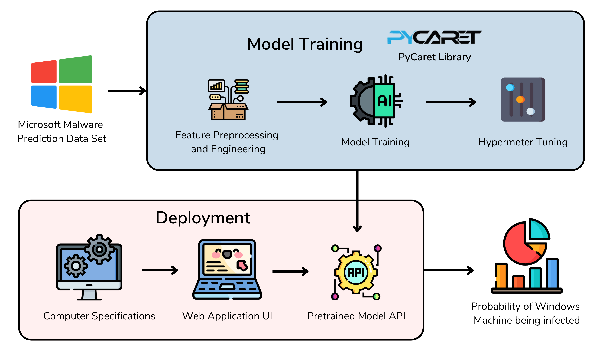

# MALPRED
> **Predictive Modeling for Malware Detection in Windows Systems using Ensemble Learning**

    
    <b>Figure 1</b>: Diagram of Structure of MALPRED

Feature Engineering
-------------------------
You can refer to `data_cleaning/` for the data cleaning system. However, for a basic idea, refer to the following diagram:

    
    <b>Figure 2</b>: Diagram of Feature Engineering in MALPRED

Results
-------------------------

| **Models**      | **AUC-ROC** | **Accuracy** | **Recall**  | **Precision** |
|-----------------|-------------|--------------|-------------|---------------|
| **Stack Model** | **73.03**   | **66.45**    | **66.25**   | **66.49**     |
| XGBoost         | 72.19       | 65.79        | 65.18       | 65.96         |
| LightGBM        | 71.25       | 65.08        | 64.21       | 65.33         |
| CatBoost        | 70.92       | 64.78        | 63.50       | 65.15         |
| MLP             | 70.72       | 64.62        | 63.56       | 64.94         |
| GBC             | 69.50       | 63.57        | 64.22       | 63.38         |
| ADA             | 68.75       | 63.14        | 64.87       | 62.68         |
| LDA             | 66.72       | 61.68        | 57.79       | 62.64         |
| QDA             | 66.23       | 56.98        | 65.85       | 61.51         |
| DT              | 57.60       | 57.60        | 57.73       | 57.56         |
| Dummy           | 50.00       | 50.02        | 00.00       | 00.00         |
| Ridge           | -           | 61.68        | 57.79       | 62.64         |
| SVM             | -           | 61.34        | 51.93       | 63.97         |

Web Application
-------------------------

    
    <b>Figure 3</b>: Web Application of MALPRED

